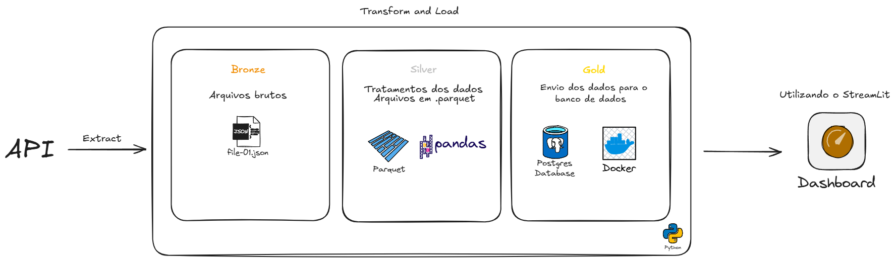
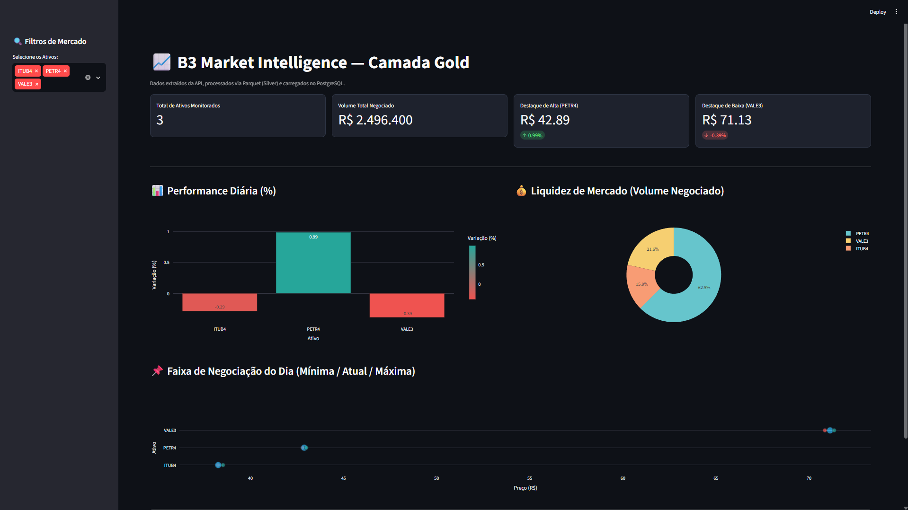

# Pipeline B3 — ETL de Ações e Dashboard



## 📊 Dashboard de Visualização




Este projeto implementa um pipeline de dados para monitoramento de ações da B3 utilizando um DataLake:

- Bronze: dados brutos extraídos da API pública da B3/BrAPI
- Silver: dados transformados e salvos em Parquet
- Gold: dados carregados para PostgreSQL e exibidos em um dashboard do Streamlit

## Visão geral

O fluxo funciona da seguinte forma:

1. O script principal executa a extração dos ativos configurados em `main.py`
2. A classe `Extract` busca os dados da API e salva em arquivos JSON na pasta `data-lake/bronze`
3. A classe `Transform` lê o JSON, seleciona os campos relevantes, trata e salva em Parquet em `data-lake/silver`
4. A classe `Load` carrega os dados para uma tabela PostgreSQL chamada `fato_cotacoes`
5. O dashboard em `app.py` consulta essa tabela e exibe KPIs e gráficos

## Estrutura do projeto

```text
pipeline-b3/
├── app.py                     # Dashboard em Streamlit
├── main.py                    # Orquestra o pipeline ETL
├── docker-compose.yml         # PostgreSQL em container
├── data-lake/
│   ├── bronze/                # Arquivos JSON brutos
│   └── silver/                # Arquivos Parquet tratados
├── src/
│   ├── extract.py             # Extração da API
│   ├── transform.py           # Limpeza e transformação dos dados
│   └── load.py                # Carga no PostgreSQL
└── README.md
```

## Requisitos

- Python 3.10+
- Docker Desktop / Docker Engine
- PostgreSQL via container
- Dependências Python:

```bash
pip install requests pandas pyarrow sqlalchemy psycopg2-binary streamlit plotly
```

## Configuração do banco de dados

O projeto usa o PostgreSQL configurado em `docker-compose.yml` com os seguintes parâmetros:

- Usuário: `admin`
- Senha: `senha123`
- Banco: `acoes`
- Porta: `5432`

Para subir o banco localmente:

```bash
docker compose up -d
```

## Como executar o pipeline

Na raiz do projeto:

```bash
python main.py
```

O arquivo `main.py` executa a sequência para os ativos:

```python
ativos = ["PETR4", "VALE3", "ITUB4"]
```

Você pode alterar essa lista para incluir outros tickers ou remover alguns.

## Como abrir o dashboard

Depois que o pipeline já carregou dados no banco:

```bash
streamlit run app.py
```

O dashboard abre no navegador e mostra:

- total de ativos monitorados
- volume total negociado
- destaque de alta e baixa
- desempenho diário por ativo
- gráfico de volume
- faixa de negociação do dia
- tabela com os dados finais

## Arquivos gerados

### Bronze
Os dados brutos ficam em:

```text
data-lake/bronze/
```

Arquivos no formato JSON com a resposta da API.

### Silver
Os dados transformados ficam em:

```text
data-lake/silver/
```

Arquivos no formato Parquet.

## Estrutura da tabela Gold

A tabela `fato_cotacoes` contém, em geral, as colunas:

- `ativo`
- `nome_empresa`
- `preco_atual`
- `variacao_pct`
- `maxima_dia`
- `minima_dia`
- `preco_fechamento_anterior`
- `volume_negociado`
- `data_hora_coleta`

## Observações

- O pipeline usa a API pública BrAPI para obter cotações de ações
- O processamento em Silver normaliza e organiza os dados para carregamento analítico
- O dashboard lê diretamente os dados mais recentes de cada ativo no PostgreSQL

## Dicas de uso

- Para atualizar dados, rode novamente:

```bash
python main.py
```

- Para visualizar os dados mais recentes sem reiniciar o dashboard, basta atualizar a página no Streamlit

## Troubleshooting

### Erro de conexão com PostgreSQL
Verifique se o container está ativo:

```bash
docker ps
```

Se necessário, reinicie o ambiente:

```bash
docker compose down -v
docker compose up -d
```

### Nenhum dado encontrado no dashboard
Execute primeiro o pipeline:

```bash
python main.py
```

Depois abra o dashboard:

```bash
streamlit run app.py
```

---

Projeto pensado para demonstrar um fluxo completo de ETL em camada de dados, com coleta, transformação, armazenamento e visualização analítica.
